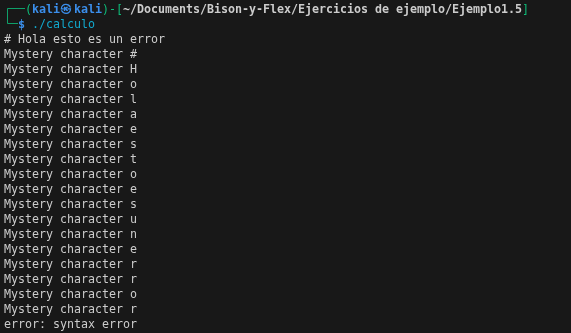

# ¿La calculadora aceptara lineas que contenga un comentario?
---
No, ya que en las reglas en el archivo de .l, solo existe una accion para la regla en la que se encuentre un espacio o un tabulador
```bash
[ \t] { /* ignore whitespace */ } 
```
Por lo tanto flex, no reconocera  que es un comentario y segun la regla . imprimira el caracter desconocido.
---
Por la parte de Bison, este generara un error dado que no reconoce el caracter de comentario:
```bash
void yyerror(const char *s)
{
    fprintf(stderr, "error: %s\n", s);
}
```
## Ejemplo de output con un caracter de comentario
