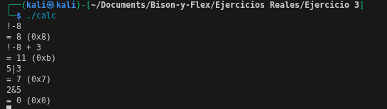

# Ejercicio 2

Escribimos las reglas gramaticales con bison:
```bash
%{
#include <stdio.h>

int yylex(void);
void yyerror(const char *s);
%}

%token NUMBER
%token ADD SUB MUL DIV ABS
%token EOL

%%

calclist: /* nothing */
    | calclist exp EOL { 
        printf("= %d (0x%x)\n", $2, $2);  /* Mostrar en decimal y hex */
      }
;

exp: factor          { $$ = $1; }
    | exp ADD factor { $$ = $1 + $3; }
    | exp SUB factor { $$ = $1 - $3; }
;

factor: term         { $$ = $1; }
      | factor MUL term { $$ = $1 * $3; }
      | factor DIV term { if ($3 == 0) {
                                    yyerror("division por cero");
                                    $$ = 0;
                                } else {
                                    $$ = $1 / $3;
                                } }
;

term: NUMBER        { $$ = $1; }
    | ABS term      { $$ = $2 >= 0 ? $2 : -$2; }
;

%%

int main() {
    yyparse();
    return 0;
}

void yyerror(const char *s) {
    fprintf(stderr, "Error: %s\n", s);
}
```
---
Escribimos las relgas lexicas con flex:

```bash
%{
#include <stdlib.h>
#include "ejemplo.tab.h"

%}

%%

"+"    { return ADD; }
"-"    { return SUB; }
"*"    { return MUL; }
"/"    { return DIV; }
"!"    { return ABS; }
[0-9]+ { yylval = atoi(yytext); return NUMBER; }       /* convierte decimal */
0x[0-9a-fA-F]+ { 
    yylval = (int)strtol(yytext, NULL, 16);            /* convierte hexadecimal */
    return NUMBER; 
}
\n     { return EOL; }
[ \t]  { /* ignora espacios en blanco*/ }
.      { printf("Carater no reconocido: %c\n", *yytext); }

%%
int yywrap(void){return 1;}
```

Ejecutamos el código y ingresamos un input:



Como vemos, con la agregacion de importancia en el bison, prioriza el token de ABS y permite realizar las operaciones entre diferentes compuertas logicas, lo que hace bison por debajo de la ejecucion, es convertir los decimales en bits para realizar las compuertas logicas correspondientes, luego los vuelve a decimales y los imprime. 
