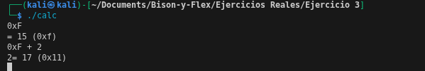
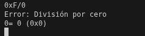

# Ejercicio 3

Escribimos las reglas gramaticales con bison, agregamos nuevos tokens en base a la calculadora anterior y actualizamos la gramatica para las compuertas AND, OR y el operador ABS
```bash
%{
#include <stdio.h>

int yylex(void);
void yyerror(const char *s);
%}

%token NUMBER
%token ADD SUB MUL DIV ABS AND OR EOL

/* Definición de precedencia de operadores */
%left OR             /* Menor precedencia */
%left AND
%left ADD SUB
%left MUL DIV
%nonassoc ABS       

%%

calclist: 
    | calclist exp EOL { printf("= %d (0x%x)\n", $2, $2); }
;

exp: term
    | exp ADD term { $$ = $1 + $3; }
    | exp SUB term { $$ = $1 - $3; }
    | exp OR term  { $$ = $1 | $3; }
    | exp AND term { $$ = $1 & $3; }
;

term: factor
    | term MUL factor { $$ = $1 * $3; }
    | term DIV factor { 
        if ($3 == 0) {
            yyerror("División por cero");
            $$ = 0;
        } else {
            $$ = $1 / $3;
        }
      }
;

factor: NUMBER
      | ABS factor { $$ = $2 >= 0 ? $2 : -$2; }
;

%%

int main() {
    yyparse();
    return 0;
}

void yyerror(const char *s) {
    fprintf(stderr, "Error: %s\n", s);
}

```
---
Escribimos las relgas lexicas con flex:

```bash
%{
#include <stdlib.h>
#include "ejemplo.tab.h"

%}

%%

"+"    { return ADD; }
"-"    { return SUB; }
"*"    { return MUL; }
"/"    { return DIV; }
"!"    { return ABS; }
"&"    { return AND; }
"|"    { return OR; }
-?[0-9]+ { yylval = atoi(yytext); return NUMBER; }       /* convierte decimal */
0x[0-9a-fA-F]+ { 
    yylval = (int)strtol(yytext, NULL, 16);            /* convierte hexadecimal */
    return NUMBER; 
}
\n     { return EOL; }
[ \t]  { /* ignora espacios en blanco*/ }
.      { printf("Carater no reconocido: %c\n", *yytext); }

%%

```

Ejecutamos el código y ingresamos un input:



En esta imagen vemos que si ingresamos un numero en hexadecimal (0x...) y realizamos operaciones entre si, el programa muestra el valor y el resultado de la operacion, tanto en valor decimal como en hexadecimal. Cabe recalcar que tambien reconoce expresiones en mayusculas o en minisculas, como es en el caso de 0xf y 0xF.



Si aplicamos la division, vemos que tambien aplica la regla de la division por 0 y si es valida la operacion, muestra en decimal y en hexadecimal.

