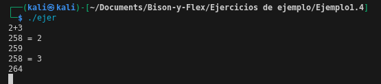

# ¿Los mismos tokens en el ejemplo 1.4 reconoce exactamente los tokens producidos por la nueva calculadora?

Si imprimimos los caracteres del ejercicio 1.4, que es donde le asignamos un numero mayor a 258, este imprimira el token. Esto significa que nostros le asignamos explicitamente un token.

Como vemos, muestra el numero del token al ingresar una expresion.