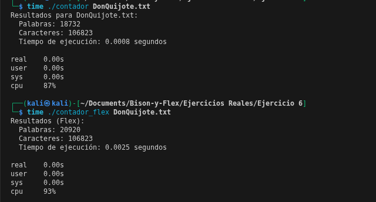

# Diferencia entre FLex y C
---
En este ejemplo, realizamos un conteo de palabras y de caracteres en C, para luego comparar con el tiempo que tarda en hacerlo en varios archivos con el mismo programa pero en flex.
# Codigo en C
```bash
#include <stdio.h>  /* Libreria para hacer operaciones en el codigo*/
#include <ctype.h>
#include <time.h> /* Libreria para contar el tiempo*/

#define IN_WORD 1 /*Estado activo si hay una palabra*/
#define OUT_WORD 0 /* Estado no activo si no hay una palabra*/

int main(int argc, char *argv[]) {
    FILE *file; /* puntero al archivo*/
    int c, state = OUT_WORD;
    unsigned long word_count = 0, char_count = 0; /* creacion de variables para conteo */
    clock_t start, end; /* variables de tipo cloc_t*/
    double cpu_time_used;

    if (argc < 2) { /*Es decir si se ingresa un archivo*/
        printf("Uso: %s <archivo>\n", argv[0]); /*imprime el nombre del archivo*/
        return 1;
    }

    start = clock(); /*comienza el tiempo a contar*/
    
    if ((file = fopen(argv[1], "r")) == NULL) { /* Inteta abrir el archivo*/
        perror("Error al abrir archivo");
        return 1;
    }

    while ((c = fgetc(file)) != EOF) { /*asinga el caracter c al caracter que se encuentra en el archivo si no se acaba la linea de texto*/
        char_count++; /*aumenta los caracteres*/
        
        if (isspace(c) || c == ',' || c == '.') { /* verifica si hay espacios, comas o puntos en los caracteres*/
            if (state == IN_WORD) { /* Si estamos dentro de una palabra, suma 1 a la cuenta de palabras*/
                word_count++;
            }
            state = OUT_WORD; /*cambia de estado a afuera de palabra*/
        } else {
            state = IN_WORD; /*si no hay espacios, sigue el estado de "en palabra"*/
        }
    }

    // Contar última palabra si el archivo no termina con espacio
    if (state == IN_WORD) {
        word_count++;
    }

    end = clock(); /*variable para calcular el tiempo*/
    cpu_time_used = ((double)(end - start)) / CLOCKS_PER_SEC;

    fclose(file);

    printf("Resultados para %s:\n", argv[1]);
    printf("  Palabras: %lu\n", word_count);
    printf("  Caracteres: %lu\n", char_count);
    printf("  Tiempo de ejecución: %.4f segundos\n", cpu_time_used);

    return 0;
}
```
# Codigo en Flex
```bash

%{
#include <stdio.h>
#include <time.h>

unsigned long word_count = 0, char_count = 0;
clock_t start, end;
%}

%%
[a-zA-ZáéíóúÁÉÍÓÚñÑ]+ { word_count++; char_count += yyleng; }
.                    { char_count++; }
\n                   { char_count++; }
%%

int main(int argc, char **argv) {
    if (argc < 2) {
        fprintf(stderr, "Uso: %s <archivo>\n", argv[0]);
        return 1;
    }
    
    start = clock();
    
    yyin = fopen(argv[1], "r");
    if (!yyin) {
        perror("Error al abrir archivo");
        return 1;
    }
    
    yylex();
    
    end = clock();
    double cpu_time_used = ((double)(end - start)) / CLOCKS_PER_SEC;
    
    fclose(yyin);
    
    printf("Resultados (Flex):\n");
    printf("  Palabras: %lu\n", word_count);
    printf("  Caracteres: %lu\n", char_count);
    printf("  Tiempo de ejecución: %.4f segundos\n", cpu_time_used);
    
    return 0;
}

```
## Comparacion



