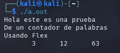

# Ejemplo 1.1

Escribimos el codigo usando nano y escribiendo linea por linea:

```bash
/* just like Unix wc */

%{
    int chars = 0;
    int words = 0;
    int lines = 0;
%}

%%

[a-zA-Z]+ { words++; chars += strlen(yytext); }
\n        { chars++; lines++; }
.         { chars++; }

%%

int main(int argc, char **argv)
{
    yylex();
    printf("%8d%8d%8d\n", lines, words, chars);
    return 0;
}
```

Ejecutamos el código de compilacion :



Escribimos un input:
