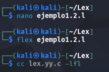
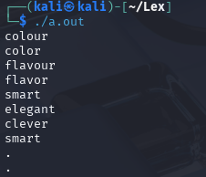
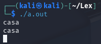

# Ejemplo 1.2

Escribimos el codigo usando nano y escribiendo linea por linea:

```bash
/* English -> American */
%%
"colour"        { printf("color"); }
"flavour"       { printf("flavor"); }
"clever"        { printf("smart"); }
"smart"         { printf("elegant"); }
"conservative"  { printf("liberal"); }
.|\n            { printf("%s", yytext); }
%%

int main(int argc, char **argv) {
    yylex(); /*Llama a la variable yylex que se encarga de realizar las comparaciones de las reglas */
    return 0; 
}

```

Ejecutamos el código de compilacion:



Ingresamos un input:



En este tipo de ejemplo con Flex, el archivo de especificacion define patrones de texto (strings) y las acciones que se deben ejecutar cuando se detecta cada patron. El programa actúa como un "diccionario" simple: cuando el usuario ingresa una palabra clave, el programa responde con una traduccion o significado predefinido.
---
Nota:
En la siguiente parte del codigo:
```bash
.|\n            { printf("%s", yytext); }
```
Si se ingresa una palabra no perteneciente al diccionario ejemplo "casa", el programa imprimira lo que la variable yytext este almacenando (el string en si).


