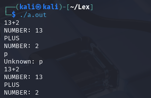

# Ejemplo 1.3

Escribimos el codigo usando nano y escribiendo linea por linea:

```bash
/* recognize tokens for the calculator and print them out */
%%
":"    { printf("COLON\n"); }
"-"    { printf("MINUS\n"); }
"+"    { printf("PLUS\n"); }
"*"    { printf("TIMES\n"); }
"/"    { printf("DIVIDE\n"); }
"!"    { printf("ABS\n"); }
[0-9]+ { printf("NUMBER %s\n", yytext); }
\n     { printf("NEWLINE\n"); }
[ \t]  { /* ignora espacios y tabulaciones */ }
.      { printf("Mystery character %s\n", yytext); } /* Si se agrega un caracter diferente al que reconoce el scanner, lo imprime*/
%%

int main() {
    yylex();
    return 0;
}

```

Ejecutamos el código y ingresamos un input:



Este codigo en flex sirve para leer una expresion que tiene dos numeros y un operador (como suma, resta, multiplicacion o division). El programa revisa el caracter del operador y si es uno de los validos (+, -, *, /), lo imprime. Si el usuario ingresa un caracter que no es un operador valido, el programa muestra un mensaje diciendo que el caracter no es valido. Asi, solo acepta los operadores basicos y rechaza cualquier otro simbolo.
