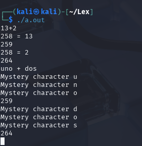

# Ejemplo 1.4

Escribimos el codigo usando nano y escribiendo linea por linea:

```bash
/* recognize tokens for the calculator and print them out */
%{
#include <stdlib.h>
/* Incluimos la libreria porque tiene metodos de parseo de enteros a string (atoi, atol, strol)*/

enum yytokentype { /* enumeracion para darle un valor entero a varibles*/
    NUMBER = 258,
    ADD = 259,
    SUB = 260,
    MUL = 261,
    DIV = 262,
    ABS = 263,
    EOL = 264
};

int yylval; /* Permite la obtencion de un valor entero, para realizar operaciones*/
%}

%%

"+"    { return ADD; }
"-"    { return SUB; }
"*"    { return MUL; }
"/"    { return DIV; }
"!"    { return ABS; }
[0-9]+ { yylval = atoi(yytext); return NUMBER; } /* Convierte el string ingresado a entero usando (atoi) luego retorna el valor de NUMBER*/
\n     { return EOL; }
[ \t]  { /* ignore whitespace */ }
.      { printf("Mystery character %c\n", *yytext); }

%%

int main(int argc, char **argv) {
    int tok;
    
    while(tok = yylex()) { /* realiza una asignacion de variables, mientras que se pueda asignar se repite el bucle*/
        printf("%d", tok);
        if(tok == NUMBER)
            printf(" = %d\n", yylval);
        else
            printf("\n");
    }
    
    return 0;
}

```

Ejecutamos el código y ingresamos un input:



Este codigo en flex sirve para leer una expresion que tiene dos numeros y un operador (como suma, resta, multiplicacion o division). El programa revisa el caracter del operador y si es uno de los validos (+, -, *, /), lo imprime. Si el usuario ingresa un caracter que no es un operador valido, el programa muestra un mensaje diciendo que el caracter no es valido. Asi, solo acepta los operadores basicos y rechaza cualquier otro simbolo.
