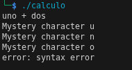

# Ejemplo 1.5

# BNF
El BNF consta de una funcionalidad semantica validas para un lenguaje de programacion.
Si lo comparamos con el español: "Una oracion es valida si tiene un sujeto, un verbo y un objeto".
```bash
<Oracion> ::= <Sujeto> <Verbo> <Objeto>  
<Sujeto>  ::= "El estudiante" | "La pizza"  
<Verbo>   ::= "come" | "programa"  
<Objeto>  ::= "codigo" | "carbohidratos"  
```
De esta manera podemos crear una oracion: "El estudiante come carbohidratos".
---
Una expresion BNF se compone de los siguientes aspectos:
* No terminales (Expresados por < >)
* Terminales (tokens o palabras)
* Reglas (instrucciones dadas por ::=)

Escribimos el codigo para el compilador de bison:

```bash
%{
#include <stdio.h>

/* Declaraciones explícitas para evitar warnings */
int yylex(void);
void yyerror(const char *s);
%}

/* declare tokens */
%token NUMBER
%token ADD SUB MUL DIV ABS
%token EOL

%%

calclist: /* nothing */
    | calclist exp EOL { printf("= %d\n", $2); }
;

exp: factor          { $$ = $1; }
    | exp ADD factor { $$ = $1 + $3; }
    | exp SUB factor { $$ = $1 - $3; }
;

factor:
        term                 { $$ = $1; }
        | factor MUL term    { $$ = $1 * $3; }
        | factor DIV term    { 
                                if ($3 == 0) {
                                    yyerror("division por cero");
                                    $$ = 0;
                                } else {
                                    $$ = $1 / $3;
                                }
                              }
;

term: NUMBER        { $$ = $1; }
    | ABS term      { $$ = $2 >= 0 ? $2 : -$2; }
;

%%

int main(int argc, char **argv)
{
    yyparse();
    return 0;
}

void yyerror(const char *s)
{
    fprintf(stderr, "error: %s\n", s);
}

```

Escribimos el codigo de Flex, incluyendo la libreria .h que genera el compilador de bison:

```bash
%{
#include <stdio.h>
#include <stdlib.h>
#include "ejemplo.tab.h"   /* generado por Bison; contiene definiciones de tokens y de yylval */
%}

%%
"+"    { return ADD; }
"-"    { return SUB; }
"*"    { return MUL; }
"/"    { return DIV; }
"!"    { return ABS; }
[0-9]+ { yylval = atoi(yytext); return NUMBER; }
\n     { return EOL; }
[ \t]  { /* ignorar espacios */ }
.      { printf("Mystery character %s\n", yytext); }
%%
/* yywrap para no ingresar la flag -lfl*/
int yywrap(void) {
    return 1;
}


```
Ejecutamos el código y ingresamos un input:


Como vemos, el programa reconoce la divsion por 0 e muestra por pantalla que no se puede realizar, para las demas operaciones como suma, resta y multiplicacion da el resultado de la operacion aritmetica.



Si se ingresa un caracter no valido, como lo es en lenguaje natural, muestra en pantalla el caracter que no es valido (codigo hecho en el .l) y produce un error de syntaxis, (error producido por el parser)
