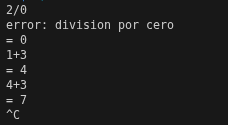

# Ejemplo 1.5

# BNF
El BNF consta de una funcionalidad semantica validas para un lenguaje de programacion.
Si lo comparamos con el español: "Una oracion es valida si tiene un sujeto, un verbo y un objeto".
```bash
<Oracion> ::= <Sujeto> <Verbo> <Objeto>  
<Sujeto>  ::= "El estudiante" | "La pizza"  
<Verbo>   ::= "come" | "programa"  
<Objeto>  ::= "codigo" | "carbohidratos"  
```
De esta manera podemos crear una oracion: "El estudiante come carbohidratos".
---
Una expresion BNF se compone de los siguientes aspectos:
* No terminales (Expresados por < >)
* Terminales (tokens o palabras)
* Reglas (instrucciones dadas por ::=)

Escribimos el codigo para el compilador de bison:

```bash
/* simplest version of calculator */
%{
#include <stdio.h>
%}

/* declare tokens */
%token NUMBER
%token ADD SUB MUL DIV ABS
%token EOL

%%

callist: /* nothing */
    | callist exp EOL { printf("= %d\n", $1); } /* matches at beginning of input, EOL is end of an expression */
;

exp: factor                { $$ = $1; }
    | exp ADD factor       { $$ = $1 + $3; }
    | exp SUB factor       { $$ = $1 - $3; }
;

factor: term               { $$ = $1; }
      | factor MUL term    { $$ = $1 * $3; }
      | factor DIV term    { $$ = $1 / $3; }
;

term: NUMBER               { $$ = $1; }
    | ABS term             { $$ = $2 >= 0 ? $2 : -$2; }
;

%%

main(int argc, char **argv)
{
    yyparse();
}

yyerror(char *s)
{
    fprintf(stderr, "error: %s\n", s);
}

```

Escribimos el codigo de Flex, incluyendo la libreria .h que genera el compilador de bison:

```bash
/* recognize tokens for the calculator and print them out */
%{
#include <stdlib.h>
#include "ejemplo1.5.tab.h"

int yylval; /* Permite la obtencion de un valor entero, para realizar operaciones*/
%}

%%

"+"    { return ADD; }
"-"    { return SUB; }
"*"    { return MUL; }
"/"    { return DIV; }
"!"    { return ABS; }
[0-9]+ { yylval = atoi(yytext); return NUMBER; } /* Convierte el string ingresado a entero usando (atoi) luego retorna el valor de NUMBER*/
\n     { return EOL; }
[ \t]  { /* ignore whitespace */ }
.      { printf("Mystery character %c\n", *yytext); }

%%

```
Ejecutamos el código y ingresamos un input:



Este programa en flex reconoce numeros y operadores basicos (+, -, *, /, !) en una linea de texto. Cuando escribes un numero, lo convierte a entero y lo imprime junto con el token correspondiente. Si escribes un operador valido, imprime el token correspondiente (ADD, SUB, MUL, DIV, ABS). Si escribes un caracter que no es valido (como una letra o simbolo raro), el programa muestra un mensaje diciendo que es un "Mystery character"
